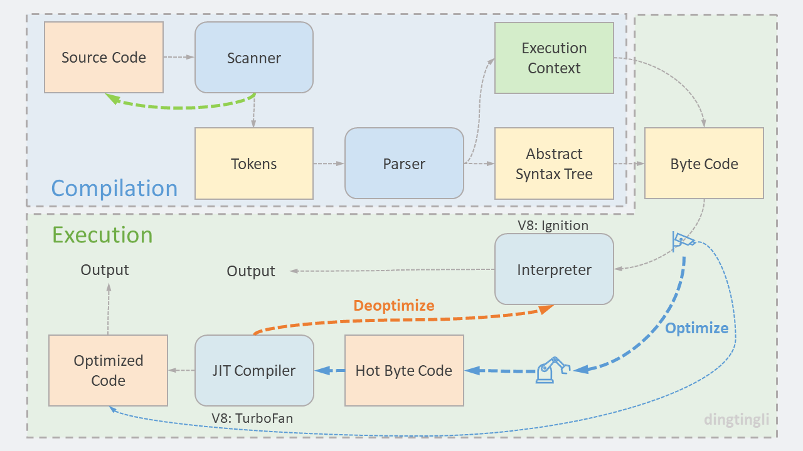
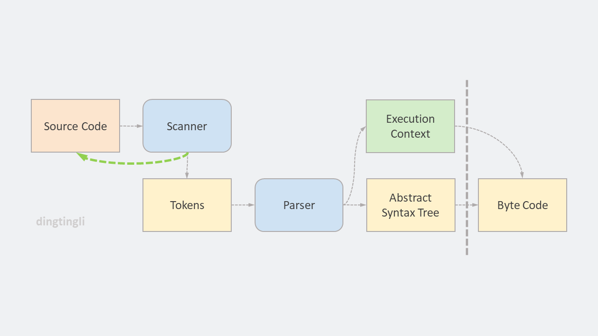
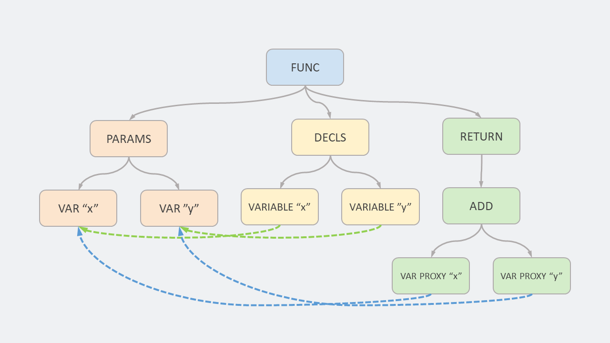
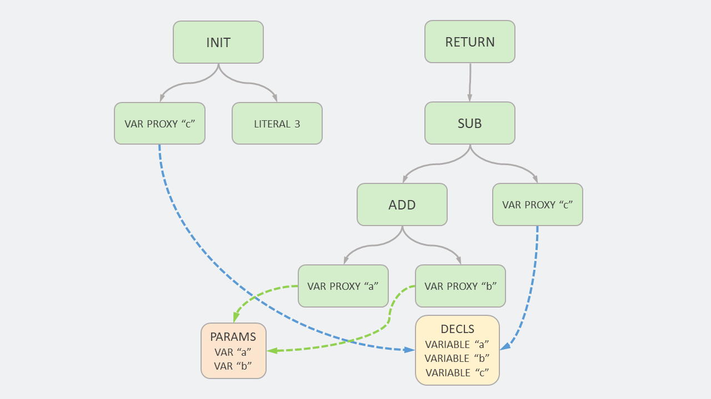
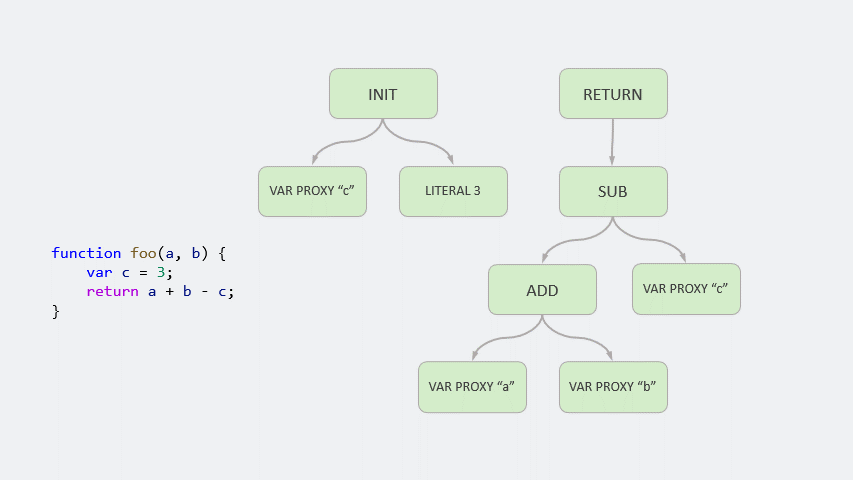
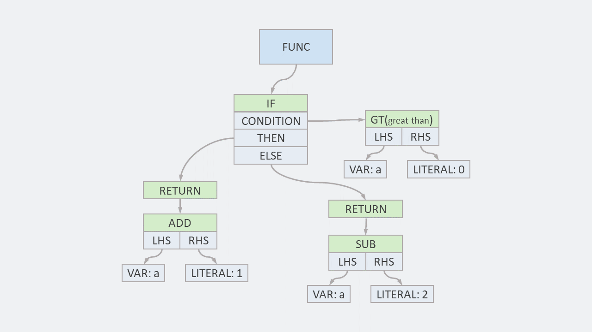
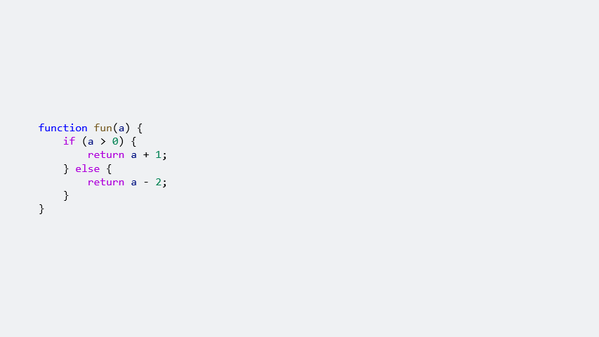

# 什么是 AST?

作者：**dingtingli**

公众号：**dingtingli-pub**



在[上一篇](Why-为什么说JavaScript更像一门编译型语言.md)文章的末尾，我们粗略地了解 JavaScript 的编译和执行阶段所做的事情。

其中有很多细节并没有详细介绍，这篇文章我们就先来看一下编译阶段的 Abstract Syntax Tree: 抽象语法树。

<figure>
    
    <figcaption><em>编译阶段</em></figcaption>
    <br><br>
</figure>

从上图中可以看到，在到达 AST 之前，源代码会被扫描器（Scanner）转换成 Token 数组，这就是编译原理中常说的分词。

JavaScript 中有几种类型的 Token ：标点（Punctuator），关键字（Keyword），标识符（Identifier） 和 Literal（数字或者字符串）。

我们可以从 V8 源文件查看具体的 [Token 列表](https://github.com/v8/v8/blob/master/src/parsing/token.h)。

以下面这段代码为例：

```js
function add(a, b) {
    return a + b;
}
```

会被转换成类似下面这样的 Token 数组：

|Type|Value|
|:--|:--|
|Keyword|function|
|Identifier|add|
|Punctuator|(|
|Identifier|a|
|Punctuator|,|
|Identifier|b|
|Punctuator|)|
|Punctuator|{|
|Keyword|return|
|Identifier|a|
|Punctuator|+|
|Identifier|b|
|Punctuator|;|
|Punctuator|}|

注：[ESPrima](https://esprima.org/demo/parse.html#) 网站提供了网页版的分词工具。

Token 数组只是将一段代码分解成了一个个最小的可识别单元——Token。这就像是我们往翻译软件中输入了一段英文，这段英文中的每个单词都会被提取出来，保存到 Token 数组中。

这些单词连在一起是否有意义？就需要按照语法将这些单词组合起来。

解析器（Parser）就是做这件事情的。将 Token 数组转化成具有语法含义的抽象语法树结构，即 AST（Abstract Syntax Tree）。

在这个过程中，同时可以验证语法，如果出现语法错误，就会抛错。

那么 AST 到底是什么样子？我们可以有三种方式查看：
1. [AST Explorer](https://astexplorer.net/)
2. [ESPrima](https://esprima.org/demo/parse.html#)
3. d8 命令行

为了更接近 V8 中的 AST，这里我们使用第三种方式 d8 命令行。

在当前机器中配置好 d8 环境（如何配置可以参考文章最下面的资源链接）。

使用如下命令进行查看：

```cmd
d8 --print-ast AST01.js
```

还以上面出现过的的示例做参考：

```js
//AST01.js
function add(a, b) {
    return a + b;
}

//add(1, 2);
```
注意：运行命令前，取消最后一行代码的注释。因为 JavaScript 是惰性解析，函数只有被调用才会解析。

使用 d8 命令后，可以看到 AST：

```
......
[generating bytecode for function: add]
--- AST ---
FUNC at 12
. KIND 0
. LITERAL ID 1
. SUSPEND COUNT 0
. NAME "add"
. PARAMS
. . VAR (0000021812F015A8) (mode = VAR, assigned = false) "a"
. . VAR (0000021812F01650) (mode = VAR, assigned = false) "b"
. DECLS
. . VARIABLE (0000021812F015A8) (mode = VAR, assigned = false) "a"
. . VARIABLE (0000021812F01650) (mode = VAR, assigned = false) "b"
. RETURN at 26
. . ADD at 35
. . . VAR PROXY parameter[0] (0000021812F015A8) (mode = VAR, assigned = false) "a"
. . . VAR PROXY parameter[1] (0000021812F01650) (mode = VAR, assigned = false) "b"
```

这段输出初看上去有点吓人，其实我们只要注意几个关键字，然后把它们想象成一个树状图就很容易理解了。

1. 首先 “FUNC”，是整棵树的根节点。在这个根节点下面有三个子节点“PARAMS”，“DECLS” 和 “RETURN”。

2. 其中 “PARAMS” 是函数的参数列表，并且标明了参数的内存地址，比如第一个参数 `a` 的地址是 `0000021812F015A8` 。

3. “DECLS” 是函数中所有变量的声明，示例中函数的变量声明只有上面提到的参数，所以相应的内存地址都指向了 “PARAMS” 中的参数。

4. 最后是 “RETURN” ，该函数中唯一的逻辑代码。从中我们可以看到 “ADD” 节点下面对应了两个参数 a 和 b， 说明是这两个值相加。然后 “RETURN” 连接了 “ADD” 节点，说明最后返回相加的结果。

<figure>
    
    <figcaption><em>AST01 树状结构</em></figcaption>
    <br><br>
</figure>

我们再来看一个例子：

```js
//AST02.js
function fun(a, b) {
    var c = 3;
    return a + b - c;
}

//fun(1, 2);
```

这个例子和上面一个例子类似，只是函数内部多了一个自定义变量 `c`。

```
......
[generating bytecode for function: fun]
--- AST ---
FUNC at 12
. KIND 0
. LITERAL ID 1
. SUSPEND COUNT 0
. NAME "fun"
. PARAMS
. . VAR (00000280F83B0598) (mode = VAR, assigned = false) "a"
. . VAR (00000280F83B0640) (mode = VAR, assigned = false) "b"
. DECLS
. . VARIABLE (00000280F83B0598) (mode = VAR, assigned = false) "a"
. . VARIABLE (00000280F83B0640) (mode = VAR, assigned = false) "b"
. . VARIABLE (00000280F83B06E8) (mode = VAR, assigned = false) "c"
. BLOCK NOCOMPLETIONS at -1
. . EXPRESSION STATEMENT at 34
. . . INIT at 34
. . . . VAR PROXY local[0] (00000280F83B06E8) (mode = VAR, assigned = false) "c"
. . . . LITERAL 3
. RETURN at 42
. . SUB at 55
. . . ADD at 51
. . . . VAR PROXY parameter[0] (00000280F83B0598) (mode = VAR, assigned = false) "a"
. . . . VAR PROXY parameter[1] (00000280F83B0640) (mode = VAR, assigned = false) "b"
. . . VAR PROXY local[0] (00000280F83B06E8) (mode = VAR, assigned = false) "c"
```

相应 AST 的 “DECLS” 中，函数变量声明里会多一个变量 `c`，这个变量在 “PARAMS” 中并不存在。

<figure>
    
    <figcaption><em>AST02 树状结构</em></figcaption>
    <br><br>
</figure>

函数中每个语句都会对应一个完整的树状结构。

<figure>
    
    <figcaption><em>AST02 树状结构动画</em></figcaption>
    <br><br>
</figure>

最后，我们再看一个稍微复杂一点的例子：

```js
//AST03.js
function fun(a) {
    if (a > 0) {
        return a + 1;
    } else {
        return a - 2;
    }
}

//fun(1);
```

这个示例中包含了一个 `if`……`else` 语句。

```
......
[generating bytecode for function: fun]
--- AST ---
FUNC at 12
. KIND 0
. LITERAL ID 1
. SUSPEND COUNT 0
. NAME "fun"
. PARAMS
. . VAR (0000017BED232608) (mode = VAR, assigned = false) "a"
. DECLS
. . VARIABLE (0000017BED232608) (mode = VAR, assigned = false) "a"
. IF at 23
. . CONDITION at 29
. . . GT at 29
. . . . VAR PROXY parameter[0] (0000017BED232608) (mode = VAR, assigned = false) "a"
. . . . LITERAL 0
. . THEN at -1
. . . BLOCK at -1
. . . . RETURN at 45
. . . . . ADD at 54
. . . . . . VAR PROXY parameter[0] (0000017BED232608) (mode = VAR, assigned = false) "a"
. . . . . . LITERAL 1
. . ELSE at -1
. . . BLOCK at -1
. . . . RETURN at 82
. . . . . SUB at 91
. . . . . . VAR PROXY parameter[0] (0000017BED232608) (mode = VAR, assigned = false) "a"
. . . . . . LITERAL 2
```

整个 AST 中可以清晰地看到 `if` 语句的结构：

<figure>
    
    <figcaption><em>AST03 树状结构</em></figcaption>
    <br><br>
</figure>

我们可以从动画中看到每条语句所对于的 AST 中的分支。

<figure>
    
    <figcaption><em>AST03 树状结构动画</em></figcaption>
    <br><br>
</figure>

我们现在知道 AST 是一个包含了语法含义的树状结构，从文章最开始的图中可以看出，接下来就是将 AST 转换为字节码。

关于“什么是 AST？”这个问题，我们现在应该有一个视觉上的理解了。

在结束这篇文章之前，让我们先等一下，想想 AST 还可以做什么？

我们把 AST 想象成一个包含了语法信息的数据结构，而数据结构是可以很方便地通过编程进行二次修改的，我们可以将 AST 变成另外一种形式的编程语言。

* 比如将 AST 转换为字节码，就是这种思路。

* 将 ES6 的代码转换成 ES5 的代码，也是通过 AST 来完成，所以 Bable 的核心就是 AST。

* 将 TypeScript 转换成 JavaScirpt，只需要有个编译器将 TypeScript 的代码转换成 AST 就可以实现。

* 另外，开发环境中的错误提示，代码高亮显示等功能，也是通过分析 AST 来实现的。

学习 JavaScript 的过程中经常会遇到这种情况，有些内容不知不觉地就指向了语言的深处，比如编译器，解释器的运行等等。当了解了这些内容后，一些匪夷所思的问题可能就会豁然开朗。这是学习其他语言所体会不到的。

<br/>

### 资源和参考

[1] [An Introduction to Speculative Optimization in V8](https://benediktmeurer.de/2017/12/13/an-introduction-to-speculative-optimization-in-v8/)

[2] [JavaScript Engine Functionality](https://www.pimonk.com/post/javascript-engine-functionality)

[3] [Writing a C Compiler, Part 1](https://norasandler.com/2017/11/29/Write-a-Compiler.html)

[4] [Sneak peek into Javascript V8 Engine](https://medium.com/@poojasharma_93670/sneak-peek-into-javascript-v8-engine-d2bb2eb2bdb2)

[5] [Ignition: Jump-starting an Interpreter for V8](https://docs.google.com/presentation/d/1HgDDXBYqCJNasBKBDf9szap1j4q4wnSHhOYpaNy5mHU/edit#slide=id.g17d335048f_1_2796)

[6] [深入V8引擎之代码执行机制](https://juejin.cn/post/6876421049618006023)

[7] [翻译：V8引擎如何一步一步地运行](https://github.com/dingtingli/javascript-translation/blob/main/doc/V8%E5%BC%95%E6%93%8E%E5%A6%82%E4%BD%95%E4%B8%80%E6%AD%A5%E4%B8%80%E6%AD%A5%E5%9C%B0%E8%BF%90%E8%A1%8C.md)

[8] [V8 是怎么跑起来的](https://juejin.cn/post/7021714551330570247#heading-4)

[9] [Parsing JavaScript - better lazy than eager?](https://www.youtube.com/watch?v=Fg7niTmNNLg)

[10] [手把手带你入门 AST 抽象语法树](https://juejin.cn/post/6844904035271573511)

关于 d8:

[1] [How to build V8 on Windows and not go mad](https://medium.com/angular-in-depth/how-to-build-v8-on-windows-and-not-go-mad-6347c69aacd4)

[2] [Installing V8 on a Mac](https://gist.github.com/kevincennis/0cd2138c78a07412ef21)

[3] [Building V8 with GN](https://v8.dev/docs/build-gn)

[4] [jsvu is the JavaScript (engine) Version Updater](https://github.com/GoogleChromeLabs/jsvu)

[5] [使用 jsvu 快速调试 v8](https://juejin.cn/post/6951284209319149581)

[6] [d8 安装手记](https://www.wemlion.com/post/install-d8/)

[7] [v8-debug 与 v8 编译流程](https://juejin.cn/post/6979152223485820965)