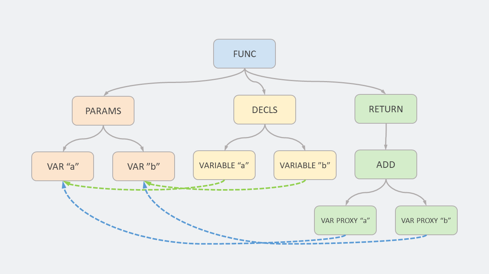

# 什么是 AST ?

作者：**dingtingli**

公众号：**dingtingli-pub**


在[上一篇](Why-为什么说JavaScript更像一门编译型语言.md)文章的末尾，我们粗略地了解 JavaScript 的编译和执行阶段所做的事情。

其中有很多细节并没有详细介绍，这篇文章我们就先来看一下编译阶段具体都做了哪些事情。


准备例子

```js
function add(a, b) {
    return a + b;
}

//console.log(add(1, 2));
```

```
[generating bytecode for function: add]
--- AST ---
FUNC at 12
. KIND 0
. LITERAL ID 1
. SUSPEND COUNT 0
. NAME "add"
. PARAMS
. . VAR (0000021812F015A8) (mode = VAR, assigned = false) "x"
. . VAR (0000021812F01650) (mode = VAR, assigned = false) "y"
. DECLS
. . VARIABLE (0000021812F015A8) (mode = VAR, assigned = false) "x"
. . VARIABLE (0000021812F01650) (mode = VAR, assigned = false) "y"
. RETURN at 26
. . ADD at 35
. . . VAR PROXY parameter[0] (0000021812F015A8) (mode = VAR, assigned = false) "x"
. . . VAR PROXY parameter[1] (0000021812F01650) (mode = VAR, assigned = false) "y"
```
<figure>
    
    <figcaption><em>AST 树状结构</em></figcaption>
    <br><br>
</figure>

```js
function fun(a, b) {
    var c = 3;
    return a + b - c;
}

//fun(1, 2);
```
```
[generating bytecode for function: fun]
--- AST ---
FUNC at 12
. KIND 0
. LITERAL ID 1
. SUSPEND COUNT 0
. NAME "fun"
. PARAMS
. . VAR (00000280F83B0598) (mode = VAR, assigned = false) "a"
. . VAR (00000280F83B0640) (mode = VAR, assigned = false) "b"
. DECLS
. . VARIABLE (00000280F83B0598) (mode = VAR, assigned = false) "a"
. . VARIABLE (00000280F83B0640) (mode = VAR, assigned = false) "b"
. . VARIABLE (00000280F83B06E8) (mode = VAR, assigned = false) "c"
. BLOCK NOCOMPLETIONS at -1
. . EXPRESSION STATEMENT at 34
. . . INIT at 34
. . . . VAR PROXY local[0] (00000280F83B06E8) (mode = VAR, assigned = false) "c"
. . . . LITERAL 3
. RETURN at 42
. . SUB at 55
. . . ADD at 51
. . . . VAR PROXY parameter[0] (00000280F83B0598) (mode = VAR, assigned = false) "a"
. . . . VAR PROXY parameter[1] (00000280F83B0640) (mode = VAR, assigned = false) "b"
. . . VAR PROXY local[0] (00000280F83B06E8) (mode = VAR, assigned = false) "c"
```

<figure>
    
    <figcaption><em>AST 树状结构</em></figcaption>
    <br><br>
</figure>

<figure>
    
    <figcaption><em>AST 树状结构</em></figcaption>
    <br><br>
</figure>

```js
function fun(a) {
    if (a > 0) {
        return a + 1;
    } else {
        return a - 2;
    }
}

//fun(1);
```

```
[generating bytecode for function: fun]
--- AST ---
FUNC at 12
. KIND 0
. LITERAL ID 1
. SUSPEND COUNT 0
. NAME "fun"
. PARAMS
. . VAR (0000017BED232608) (mode = VAR, assigned = false) "a"
. DECLS
. . VARIABLE (0000017BED232608) (mode = VAR, assigned = false) "a"
. IF at 23
. . CONDITION at 29
. . . GT at 29
. . . . VAR PROXY parameter[0] (0000017BED232608) (mode = VAR, assigned = false) "a"
. . . . LITERAL 0
. . THEN at -1
. . . BLOCK at -1
. . . . RETURN at 45
. . . . . ADD at 54
. . . . . . VAR PROXY parameter[0] (0000017BED232608) (mode = VAR, assigned = false) "a"
. . . . . . LITERAL 1
. . ELSE at -1
. . . BLOCK at -1
. . . . RETURN at 82
. . . . . SUB at 91
. . . . . . VAR PROXY parameter[0] (0000017BED232608) (mode = VAR, assigned = false) "a"
. . . . . . LITERAL 2
```
<figure>
    
    <figcaption><em>AST 树状结构</em></figcaption>
    <br><br>
</figure>

<figure>
    
    <figcaption><em>AST 树状结构</em></figcaption>
    <br><br>
</figure>