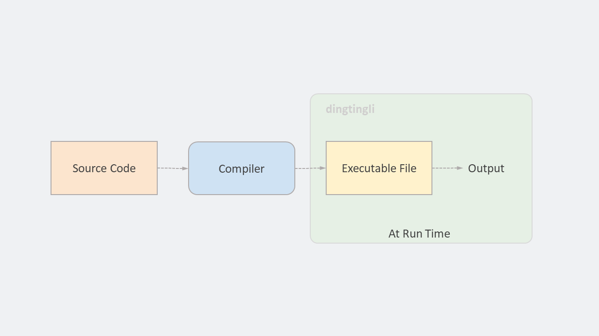
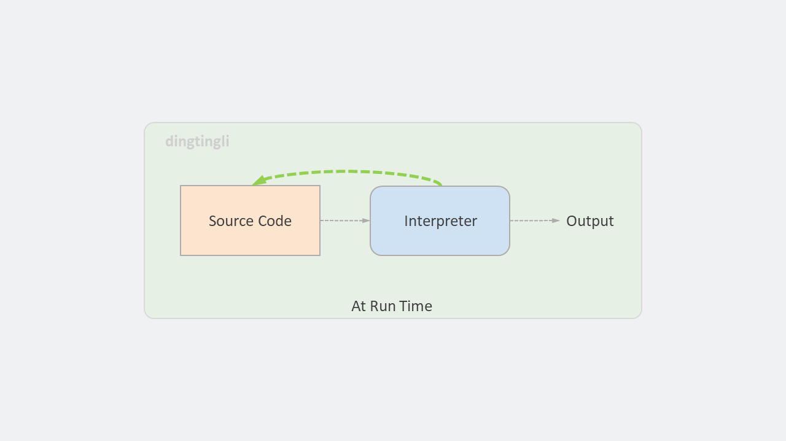
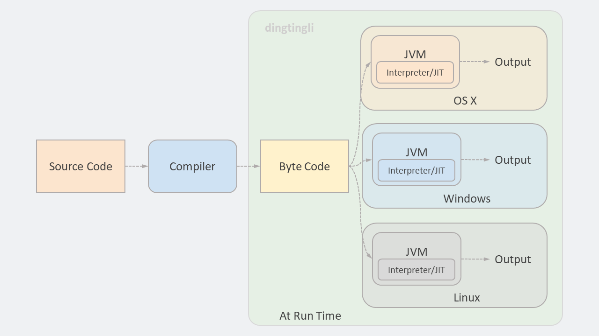
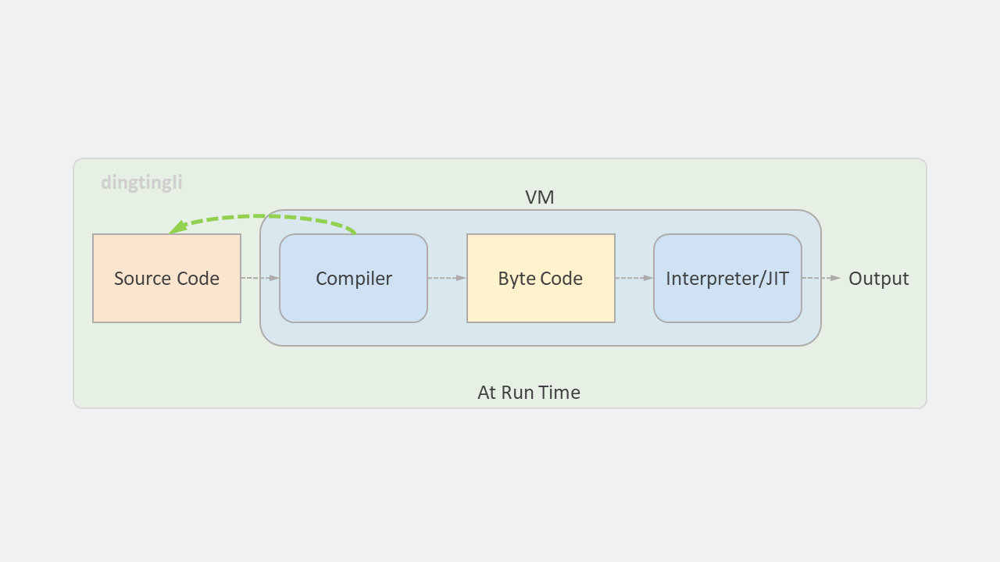
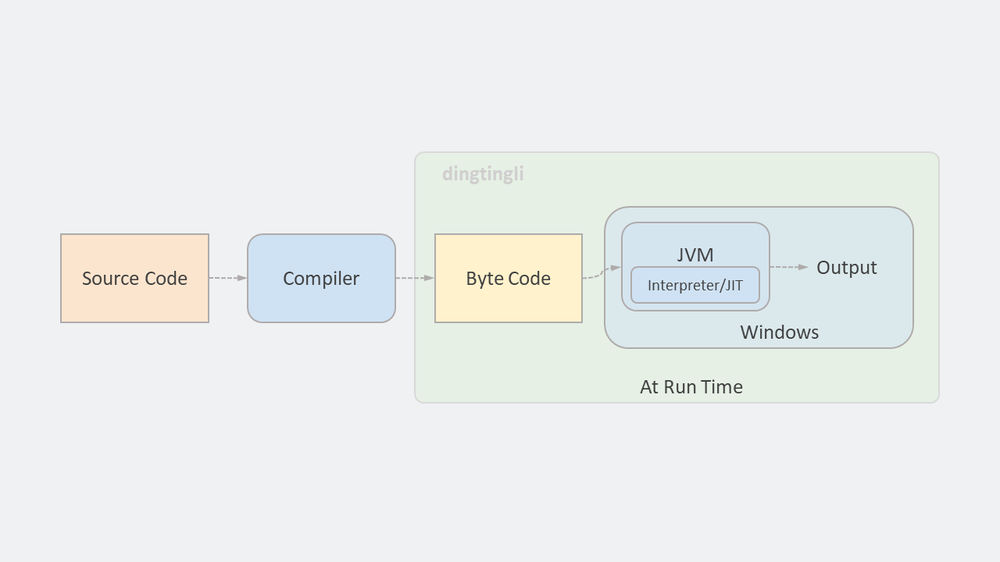
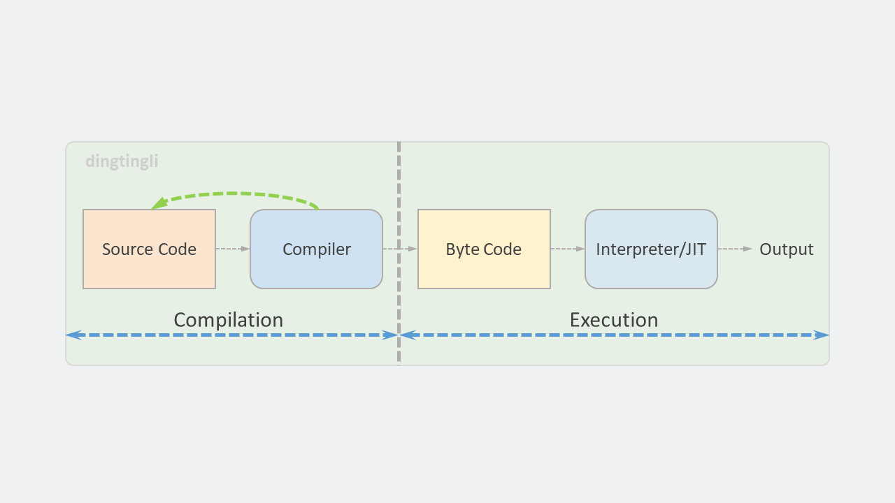
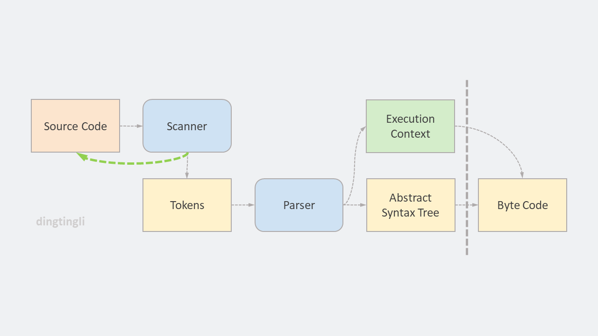
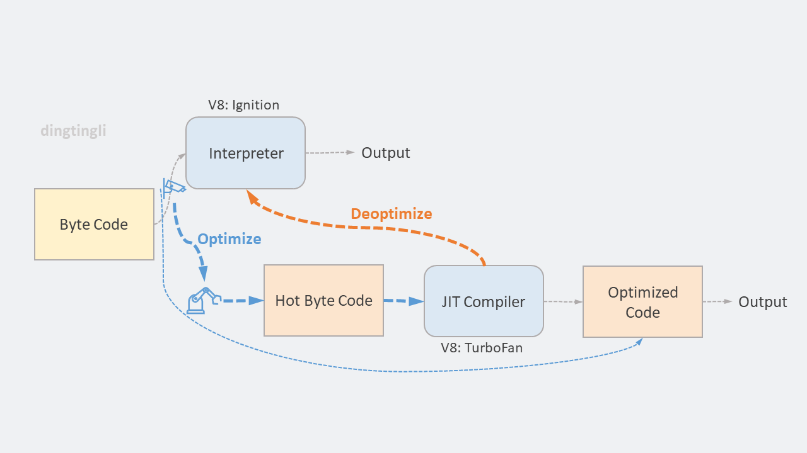
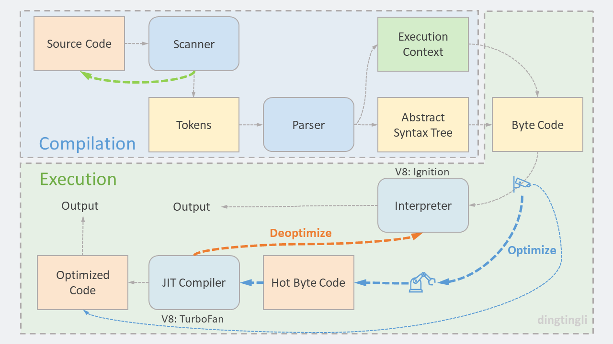

# 为什么说 JavaScript 更像一门编译型语言

作者：**dingtingli**

公众号：**dingtingli-pub**

从学习编程开始，接触到的编程语言几乎都是 C、Java、C# 这种类型的，所以一直以为所有编程语言的性质都相同。

最近，开始了解 NodeJS。发现 JavaScript 语言跟平时熟知的编程语言好像有些不一样。

之前的工作中使用 JavaScript 做过一些简单的前端开发。当时 JavaScript 给我的印象有两点，一是容易上手，语法跟其他编程语言很接近；二是代码直接放到HTML的标签中就可以了，调试也在浏览器中进行。

```html
<script src="myscripts.js"></script>
```

因为 NodeJS 是一个可以在后端运行 JavaScript 语言的环境，所以这次 NodeJS 的学习也让我第一次以学习 Java、C# 等编程语言的态度来重新审视 JavaScript 这门既熟悉又陌生的编程语言。

## Hello World

第一次使用 NodeJS，尝试写一个打印 “Hello World” 的代码。

```js
Console.log(“Hello world.”); 
```
简洁！同样的功能，C、Java、C# 这类编程语言都做不到只用一行代码。比如 C 语言的代码：

```c
//HelloWorld.c
#include <stdio.h>

int main()
{
    printf("Hello world.\n");
    return 0;
}
```

感叹于 JavaScript 语言简洁的同时，另外一个问题出现在脑海中：**JavaScript 编写的代码怎么发布？**

C 语言编写代码会编译成一个可执行文件，用户调用这个文件就可以使用。Java、C# 也有类似的功能。但是，在 NodeJS 中好像没有这个功能。

JavaScript 跟 C 语言有什么不同？为了回答这个问题，我们先回顾一下 C 语言的编译过程。

## 编译型语言

C 语言之所以被称为高级语言，是因为它使用了更方便程序员阅读和理解的语法。然而，我们知道计算机本身是无法理解 C 语言的。在计算机底层，CPU 所能理解的指令是由 0 和 1 组成的一串数字序列，也称为机器代码。 

因此，C 语言编写的代码会被转换成计算机认识的机器代码。其中的转换过程叫做编译（Compile）。

<figure>
    
    <figcaption><em>C 语言的编译过程</em></figcaption>
    <br><br>
</figure>

从图中可以看到，源代码经过编译器（Compiler）编译之后，生成了一个可执行文件——文件由机器代码组成。在运行的时候，只需要调用这个可执行文件即可。 

这个过程的一个重要的特征就是：编译过程发生在程序运行之前，就像图中的绿色框所在的位置那样。 

以这种方式执行的语言称为**编译型语言**。其中，转换工具被称为编译器（Compiler）。C、C++ 就是这类编程语言的代表。

## 解释型语言

在介绍 JavaScript 的文章中，我们经常会看到这样一句话：JavaScript 是一门解释型语言。在 JavaScript 刚诞生的时候，它的确是一门解释型的语言。 

那么什么是解释型语言？跟上面介绍的编译型语言有什么不同？

<figure>
    
    <figcaption><em>解释型语言的编译过程</em></figcaption>
    <br><br>
</figure>

解释型语言是由解释器（Interpreter）负责转换工作，而且是在程序运行的同时将源代码转换成机器代码。

跟编译型语言相比，解释型语言有几点不同：

1. 运行频率：解释器（Interpreter）一次只解释一行/一段代码，解释完就直接运行，运行后再继续解释下一行/一段代码，直到代码结束。而编译器（Compiler）会一次性将所有代码都编译成机器代码。

2. 运行方式：在解释器（Interpreter）中直接运行代码，不需要可执行文件。

3. 源代码出现的位置：在运行环境中，解释器需要调用源代码。而编译型语言的运行环境只需要调用编译后的可执行文件。

上面的第三点也解释了我们一开始的疑问，JavaScript 运行时需要源代码，而不是一个编译后的可执行文件。所以，我们看不到像 C 语言那样的编译过程和发布用的可执行文件。

| Note： |
| :--- |
| 另外还有一点，编写一个解释器要比编写一个编译器容易很多。你可能听说过，第一版的 JavaScript 解释器只用了 10 天就编写完成。在编译原理的学习过程中，大多会要求实现一个简单的解释器。有兴趣的朋友可以参考教程，动手实现一个解释器，完成之后你会对此有更深刻的理解。 |

## 解释型语言的优缺点

优点：

1. 解释器可以快速启动。执行代码之前，不需要将代码全部编译，可以直接从第一行代码直接开始解释和执行。

2. 解释型语言独立于平台。对于不同的操作系统或 CPU，只要在该平台上有对应的解释器，解释型语言就可以直接运行。开发人员不需要关心平台问题。

缺点：

1. 解释型语言需要将源代码提供给最终用户。

2. 解释型语言执行效率低。如果在多次循环中执行同一段代码，解释器必须每一次都要做同样的翻译工作。

## 编译型语言的优缺点

因为两种类型的语言运行方式的不同，所以它们之间的优缺点有时候也是互补的。 

优点：

1. 编译型语言执行效率高。一次将全部代码编译完成，可以有更多的时间和机会对代码进行优化。 

2. 编译型语言不需要提供源代码给最终用户，只需要提供编译后的可执行文件。 

缺点：
1. 编译型语言的可执行文件无法移植到不同平台。开发人员需要针对不同平台提供不同的可执行文件。

## 不一样的 Java ——编译型和解释型的结合

那么有没有办法既能拥有编译型语言的性能，又能拥有解释型语言的平台可移植性？ 

Java 就是这样一种语言，它既不适合于编译型语言的模式，也不适合于解释型语言的模式。而是结合了两者的优点，做到一次编译，到处运行。

<figure>
    
    <figcaption><em>Java 的编译过程</em></figcaption>
    <br><br>
</figure>

Java 编译器首先将源代码转换成字节码（Byte Code），字节码是一种类似于汇编的高级机器代码。这一步跟编译型语言的执行过程很接近。

字节码可以在任意平台上运行，只需在相应的平台上安装 Java 解释器，这个解释器被称为虚拟机。因而，Java 也被称为虚拟机语言。 

在虚拟机中，先解释执行字节码，当检测到有代码一直在重复执行的时候，就会转到即时编译器（Just-In-Time Compiler）中，对该段代码进行编译，以便之后执行时提高效率。 

这样 Java 语言就即兼顾了编译型语言的效率，又兼顾了解释型语言的平台独立性。但从表面特性上看，Java 语言更接近于编译型语言。

## Chrome V8 —— JavaScript 的引擎

JavaScript 的最新引擎 Chrome V8 所采用的方式和 Java 语言类似，但又有些不同。

<figure>
    
    <figcaption><em>V8 的编译过程</em></figcaption>
    <br><br>
</figure>

作为一个解决前端问题的语言，一定要保证可以快速启动，先编译再执行的方式会让用户等待太长时间。因此，V8 采用了延迟解析（lazy parsing）等方式保证了语言的快速启动，但已经不是一行一行地解释执行了。

跟解释型语言类似，源代码仍然需要在运行时提供。因此跟 Java 虚拟机相比，V8 的 JavaScript 虚拟机将编译器和解释器都包含进来，字节码的转换在虚拟机内部实现。 

<figure>
    
    <figcaption><em>Java 在单一平台上的编译过程</em></figcaption>
    <br><br>
</figure>

对比单一平台上 Java 语言虚拟机，我们可以认为 V8 既吸取了虚拟机语言的优点，又保留的解释型语言的多数特征。

## 如何理解现在的 JavaScript 语言？

从上一节的内容中可以看出，V8 引擎执行 JavaScript 代码的过程更像是编译型和解释型的结合体。那么如何理解以这种方式运行的 JavaScript 语言？ 

现在的 JavaScript 语言，并不是一行一行的解释执行，也不是全部编译后再执行。

大概的流程是，先编译当前必须的代码并执行，然后再去编译下一步必须的代码再执行。比如，一个函数是在用户点击某个按钮时才会运行，那么在用户点击按钮之前这个函数就不会被编译执行。

所以，**现在的 JavaScript 语言就像是不停地重复编译-执行流程的编译型语言。**

我们可以详细看这两个阶段：编译阶段和执行阶段。

对比 Java 等语言，编译-执行流程做的事情非常相似，只是对于同一段代码而言，Java 只需要运行一次编译-执行流程，而不是根据需要不断地重复这个流程。

<figure>
    
    <figcaption><em>JavaScript 的编译和执行</em></figcaption>
    <br><br>
</figure>

在编译阶段，与编译型语言的处理方式是类似，有两个基础操作： 

1. 词法分析：将源代码分解成有意义的 token。 

2. 解析：将 token 流变成一棵由嵌套元素组成的树。这棵树代表程序的语法结构，称作抽象语法树（Abstract Syntax Tree ：AST）。与此同时，准备好执行上下文（或者称为作用域）。

<figure>
    
    <figcaption><em>JavaScript 的编译阶段</em></figcaption>
    <br><br>
</figure>

执行上下文（or作用域）是在编译阶段中被确定的，因此理解编译阶段发生的事情对于掌握 JavaScript 的语言特性至关重要。 

从编程语言的特性来看，将 JavaScript 看作一门编译型语言也更有利于我们理解和掌握这门语言。这也是文章标题的意思的来源， JavaScript 语言的具体特性我们会在以后的文章中详细介绍。 

我们既然看过了编译阶段的内容，不妨也顺便看看执行阶段发生了什么。 

执行阶段主要是即时编译器（Just-In-Time Compiler）发挥作用，它对代码的最终性能有着重要的影响。

<figure>
    
    <figcaption><em>JavaScript 的执行阶段</em></figcaption>
    <br><br>
</figure>

上面图中的大概流程如下： 

1. 解释器会监控字节码的执行，如果发现某一段代码被重复多次执行，那么这段代码会标记为热点代码（Hot Byte code）。 

2. 热点代码（Hot Byte code）会通过即时编译器（Just-In-Time Compiler）进行优化编译，并生成二进制的机器代码。如果后面再执行到这段代码，那么就会选择优化编译后的机器代码来执行，这会大幅提升执行速度。 

3. 但是，优化后的机器代码只能满足于固定的数据结构，如果发现结构有变动，将会执行反优化操作，下次执行的时候退回到解释器来执行。 

如果之前从未了解过即时编译器（Just-In-Time Compiler），可以借此机会找些资料（参考链接中有）了解一下基本概念，比如基线编译、优化编译等。

## 总结

这时候，我们再回过头来看看 MDN 官方对 JavaScript 语言的定义： 

>JavaScript ( JS ) 是一种具有函数优先的轻量级，解释型或即时编译型的编程语言。 

>JavaScript (JS) is a lightweight, interpreted, or just-in-time compiled programming language with first-class functions. 

现在我们应该对这个定义中的后面一段话有着更深入的理解——“JavaScript (JS) 是解释型或即时编译型的编程语言”。 

从对 JavaScript 编译的疑问开始，我们就像拿到了一块拼图中的零片一样，寻找着附近的拼图零片，希望能将这些碎片一块块地拼在一起。 

最终拼出的这块拼图不仅解答了开始的疑惑，更让人意外的是，它还将不同的知识点连接在了一起。

上学时也学过编译原理，但从来没有将它跟一门现代的编程语言紧密的结合在一起。通过这次拼图，发现解决问题的关键钥匙就是编译原理在现代编程语言中的发展历程。  

最后，让我们来看看 JavaScript 语言这块拼图的全景吧。 



<br/>

### 资源和参考

[1] [翻译：You Don't Know JS Yet: Scope & Closures - 2nd Edition](https://github.com/dingtingli/javascript-translation/blob/main/doc/JavaScript%E4%B8%80%E9%97%A8%E7%BC%96%E8%AF%91%E5%9E%8B%E8%AF%AD%E8%A8%80.md)

[2] [翻译：A Deeper Inspection into Compilation and Interpretation](https://github.com/dingtingli/javascript-translation/blob/main/doc/%E6%B7%B1%E5%85%A5%E7%90%86%E8%A7%A3%E7%BC%96%E8%AF%91%E5%99%A8%E5%92%8C%E8%A7%A3%E9%87%8A%E5%99%A8.md)

[3] [翻译：A Most Perfect Union: Just-In-Time Compilers](https://github.com/dingtingli/javascript-translation/blob/main/doc/%E5%8D%B3%E6%97%B6%E7%BC%96%E8%AF%91%E5%99%A8.md)

[4] [A crash course in just-in-time (JIT) compilers ](https://hacks.mozilla.org/2017/02/a-crash-course-in-just-in-time-jit-compilers/)

[5] [翻译：The Programming Process ](https://github.com/dingtingli/javascript-translation/blob/main/doc/%E7%BC%96%E7%A8%8B%E6%B5%81%E7%A8%8B.md)

[6] [V8是如何执行一段JavaScript代码的？（付费）](https://time.geekbang.org/column/article/211682)

[7] [Why Is Dynamic Typing So Often Associated with Interpreted Languages? ](https://stackoverflow.com/questions/1393883/why-is-dynamic-typing-so-often-associated-with-interpreted-languages)

[8] [TurboFan: A new code generation architecture for V8 ](https://docs.google.com/presentation/d/1_eLlVzcj94_G4r9j9d_Lj5HRKFnq6jgpuPJtnmIBs88/edit#slide=id.g2134da681e_0_220)

[9] [翻译：How V8 JavaScript engine works step by step](https://github.com/dingtingli/javascript-translation/blob/main/doc/V8%E5%BC%95%E6%93%8E%E5%A6%82%E4%BD%95%E4%B8%80%E6%AD%A5%E4%B8%80%E6%AD%A5%E5%9C%B0%E8%BF%90%E8%A1%8C.md)

[10] [JavaScript | MDN (mozilla.org)](https://developer.mozilla.org/zh-CN/docs/Web/JavaScript)

[11] [JavaScript engine fundamentals: Shapes and Inline Caches](https://mathiasbynens.be/notes/shapes-ics)

[12] [编译器和解释器（Compiler and Interpreter）](https://juejin.cn/post/6844903853805027335)

[13] [Let’s Build A Simple Interpreter. Part 1.](https://ruslanspivak.com/lsbasi-part1/)

[14] [编译原理入门之手写一门简单的解释型语言](https://juejin.cn/post/6844904074098245646)